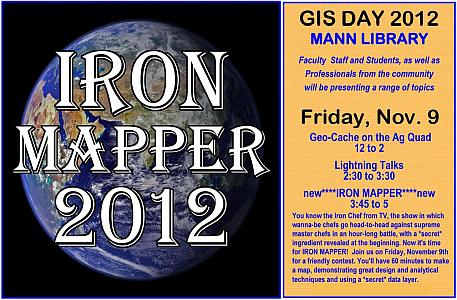

# GIS Day 2012

Friday, November 9, 2012 \
Mann Library 102

GIS Day is held each November during Geography Awareness Week, with events in more than 80 countries. Local events in Ithaca are organized by members of SynerGIS, a diverse group of GIS professionals, managers, and students from Cornell, Tompkins County, and the surrounding area. (Yes, our local event is being held a bit earlier than the official date, due to scheduling constraints.)

## Schedule of events

| When              | What                    | Where                        |
|-------------------|-------------------------|------------------------------|
| All Day           | Posters                 | Mann Library lobby           |
| 12:00pm to 2:00pm | Geocaching              | start in Mann Library Lobby  |
| 2:30pm to 3:30pm  | Lightning Talks         | Mann Library 102             |
| 3:45pm to 5:00pm  | Iron Mapper competition | Mann Library Stone Classroom |

## Posters

- Geospatial Science and Technology Instruction at Cornell
    - Steve DeGloria (Crop and Soil Sciences, Cornell)
    - Keith Jenkins (Mann Library, Cornell)
- GIS and the Humanities
    - Boris Michev (Olin Library, Cornell)
- New York State Farmland Protection: Are you in?
    - Diane Ayers (Institute for Resource Information Sciences, Crop and Soil Sciences, Cornell)
- 4-H Geospatial Sciences and Remote Sensing: Flying High... Going into Orbit...
    - Susan Hoskins (Institute for Resource Information Sciences, Crop and Soil Sciences, Cornell)
- Walks at the New York State Fair
    - Andrew Marderstein (high school student, 4-H)
- Viewing Coastal Change: Geospatial Resources for Coastal Watershed Education in the Hudson River Estuary Internship
    - Bryan Chan (undergraduate, College of Agriculture and Life Sciences, Cornell)

## Geocaching (12:00pm to 2:00pm)

Use a GPS-enabled device to try to find hidden geocaches around campus. Borrow a GPS unit from the table in the Mann Library lobby, or bring your own!

(No registration is required for geocaching – just show up!)

## Lightning Talks (2:30pm to 3:30pm)

Short presentations (about 5 minutes) given by folks from across several Cornell departments and local governments, each sharing a bit of what they are doing with Geographic Information Systems (GIS).

- Geovisualizations from the Program on Applied Demographics
    - Joe Francis (Dept. of Development Sociology, Cornell)
- [Sanborn Fire Insurance Maps as a Portal to Crowd-Sourced Historical Information: An Update](slides/Kibbee.pdf)
    - Bob Kibbee (Retired map librarian, Olin Library, Cornell)
- [Municipal GIS](slides/Aslanis.pdf)
    - Ruth Aslanis (City of Ithaca)
- [ArcMap to PDF: What are the Options?](slides/Ayers.pdf)
    - Diane Ayers (Institute for Resource Information Sciences, Dept. of Crop and Soil Sciences, Cornell)
- [Online GIS](slides/Smith.pdf)
    - Steve Smith (Institute for Resource Information Sciences, Dept. of Crop and Soil Sciences, Cornell)
- Using GIS to Model the Spread of Emerald Ash Borer through a Forest Plot
    - Sally Whisler (Dept. of Natural Resources, Cornell)
- Improving Access to USGS topographic maps
    - Keith Jenkins (Cornell University Library)
- [Introducing... Iron Mapper!](slides/Sinton.pdf)
    - Diana Sinton (University of Redlands)

## Iron Mapper

We are very excited to host (with the help of Diana Sinton) a new event this year: Iron Mapper! Inspired by "Iron Chefs", contestants will have 60 minutes to make a map using a "secret" data layer that will be revealed at the start of the event. This will be an event to remember for all time... an epic map battle to determine who rules the (cartographic) world. The number of contestants will be limited, so register now!

> **Note**
>
> This event was re-scheduled for December 5, 2012.
> Congratulations to our winners:
> - Nick Hollingshead (Iron Mapper 2012!) and Dave Bubniak (runner up)!
